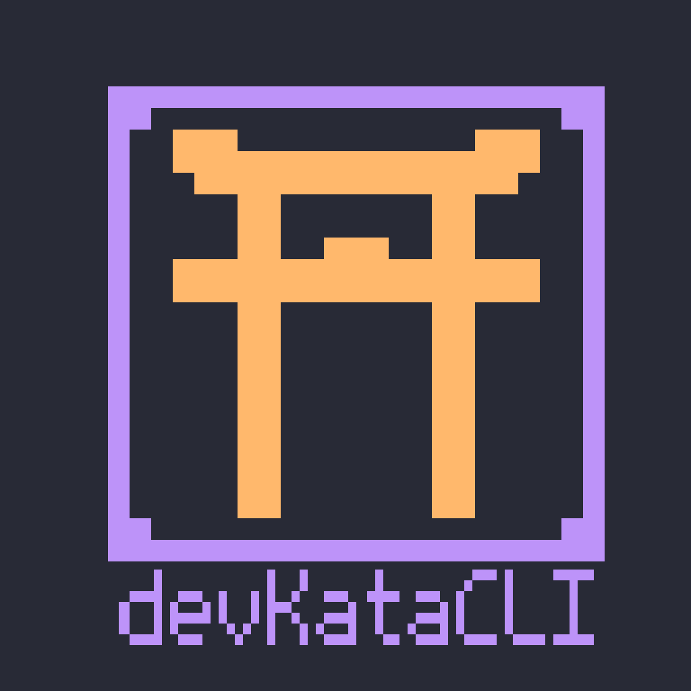

<div align="center">
  
  
  # devKataCLI
  
  
  
  
  **Master dev habits, one kata at a time**
  
  Three progressive kata types:
  
   **mini** *(10-15min)* → **nami** *(15-30min)* → **dev** *(30-45min)*

---
</div>

## Why devKataCLI?

Building consistent development habits is hard. You know you should practice regularly, review code, and stay sharp—but life gets in the way.

devKataCLI gives you structure without overwhelming you:

- **Start small** - Begin with just 10-15 minutes
- **Build progressively** - Grow your practice as habits form  
- **Zero setup** - Run from anywhere in your terminal
- **Fully customizable** - Create your own katas or use defaults
- **Track progress** - See your consistency over time

Perfect for developers who want to establish morning routines, sharpen skills through spaced repetition, or simply build more intentional coding habits.

---
## Installation

### Prerequisites
- **Node.js 18+** (ES modules support required)
- **npm** (comes with Node.js)

### Install Globally

#### **Option 1: From npm (recommended)**
```bash
npm install -g devkatacli
```

#### **Option 2: From source**
1. git clone https://github.com/fern-d3v/devKataCLI.git
2. cd devKataCLI
3. npm install
4. npm link

#### **Verify Installation**
```bash
devkata --help
```
You should see the command options and be ready to start!

---
## **Quick Start**

**1. Create Your First Kata**
    - Start by creating a kata routine:

 ```bash
 devkata new
 ```
You'll be guided through an interactive setup:

•  Choose kata type: mini (10-15min), nami (15-30min), or dev (30-45min)

•  Select template: Use defaults or create custom tasks

•  Add tasks: Interactive prompts for your routine

**2. Start Your Daily Practice**
   -Run your morning kata:

```bash
 devkata start
```

 The CLI will:

•  Load your saved kata

•  Guide you through each task

•  Track completion status

•  Save your progress

---
# **Example Workflow**
## Create a mini kata with default tasks
$ devkata new

✨ Create a new devKata routine

? What type of kata would you like to create? › miniKata (10-15 minutes)

? How would you like to configure this kata? › Use default kata

✅ miniKata created successfully with default tasks

## Start your daily practice
$ devkata start

? Select a kata to start: › miniKata

⠋ loading your kata...

✅ kata loaded!

⠋ Review yesterday's code for 10 minutes

? complete Review yesterday's code for 10 minutes? › Yes

✅ Review yesterday's code for 10 minutes completed!

⠋ Check today's tickets and prioritize

? complete Check today's tickets and prioritize? › Yes  

✅ Check today's tickets and prioritize completed!

✨ kata saved! see you tomorrow <3

---
### Available Commands

| Command | Description |
|---------|-------------|
| devkata new | Create a new kata routine (mini, nami, or dev) |
| devkata start | Start your daily kata practice |
| devkata --help | Show all available commands |

---
### Features

•  Progressive Kata Types: Start small with miniKata, build up to comprehensive devKata sessions

•  Interactive CLI Experience: Beautiful prompts powered by @clack/prompts

•  Default Templates: Pre-built kata routines based on developer best practices

•  Custom Routines: Create personalized tasks tailored to your learning goals

•  Progress Tracking: Automatic completion tracking and session history

•  Spaced Repetition: Built-in task scheduling for optimal learning

•  Zero Configuration: Works out of the box with sensible defaults

---

<div align="center"><sub>Perfect for developers who want to learn CLI development while building better coding habits!</sub></div>


## Contributing

We welcome contributions! Please see our Contributing Guidelines for details on:

•  Setting up the development environment

•  Code style and conventions  

•  Submitting pull requests

•  Reporting issues

For questions or discussions, feel free to open an issue.

## License

This project is licensed under the MIT License - see the *LICENSE* file for details.

---

<div align="center">
  <sub>Built with ❤️ for developers who value consistency and growth</sub>
</div>
<div align="center">⛩️</div>